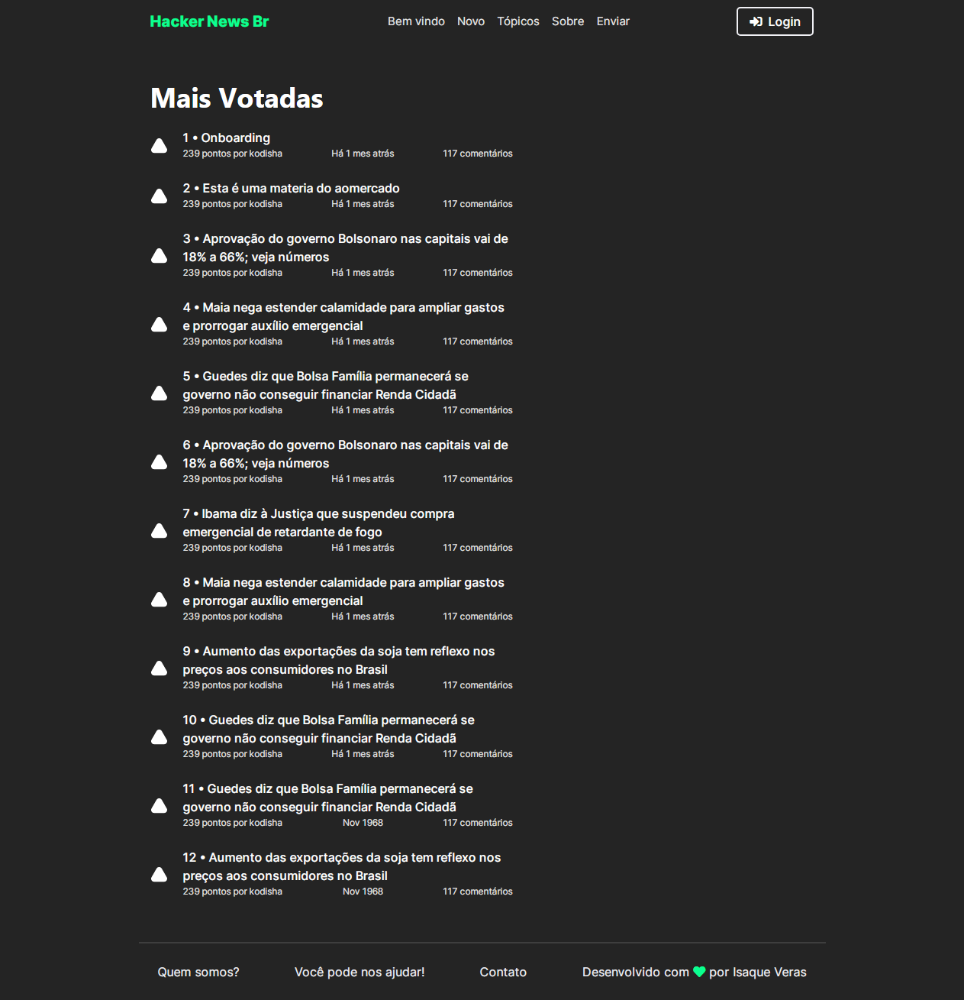
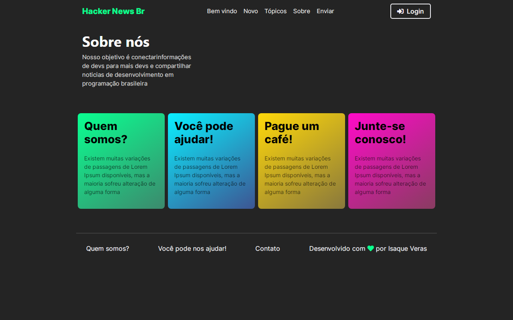
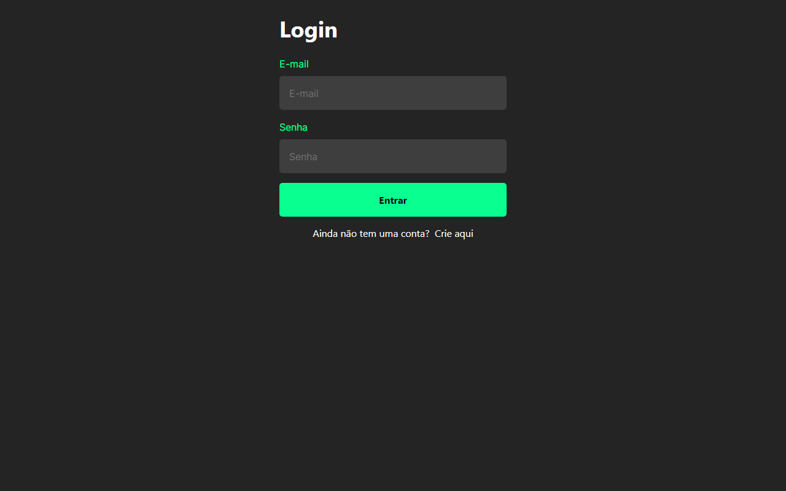
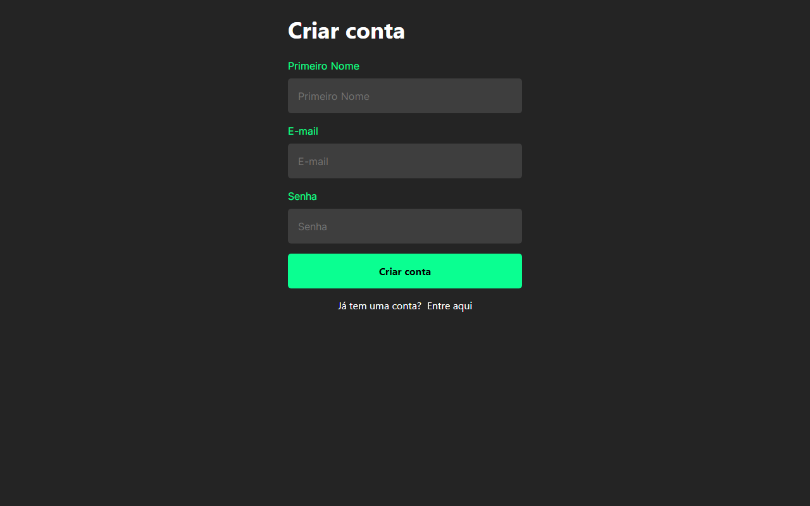
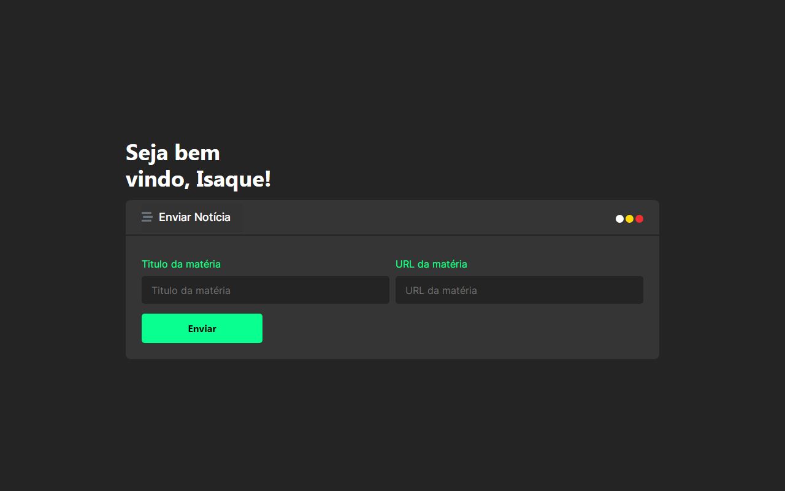

# Redesign do site HackerNews
Um modelo de redesign do site hacker news.

O sistema está precisando de alguém para implementar a lógica para indexar as noticias.
    
O modelo do hacker news é basicamente assim: um usuário envia uma noticia e essas noticias são indexadas com a quantidade de pontos que ela vai tendo, esses pontos são os usuário que dão a elas. 

Essa noticia só pode ser indexada somente uma vez, todo dia tendo noticias novas na página principal com a relevancia de mais pontos.

## Tela de início 

## Tela Principal 

## Tela sobre
Esta tela só esta concluida o design dela, precisa de colocar as informações corretas nos cards

## Tela login 

## Tela cadastro 

## Tela dashboard 
É aqui que tudo acontece, onde o usuário usa para enviar sua sugestão de link

